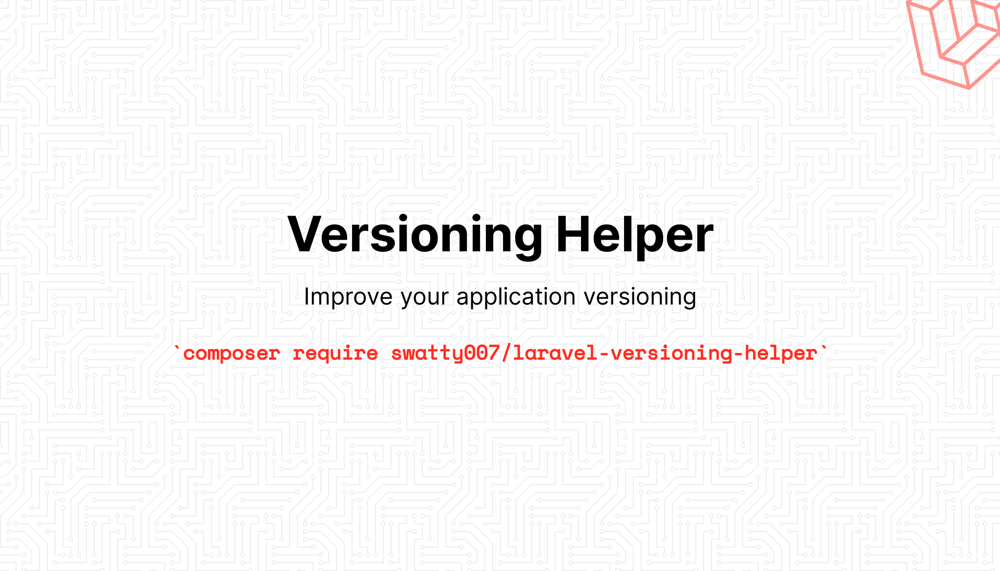
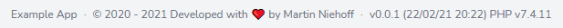
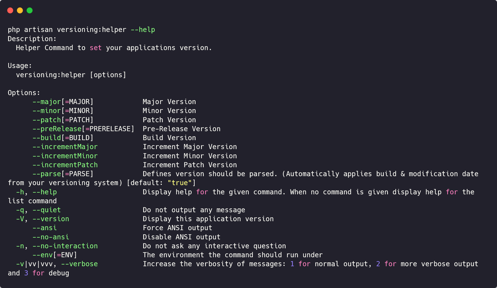

# Laravel Versioning Helper



[](https://packagist.org/packages/swatty007/laravel-versioning-helper)
[](https://opensource.org/licenses/MIT)
[](https://www.travis-ci.com/swatty007/laravel-versioning-helper)
[](https://github.styleci.io/repos/340988427?branch=main)
[](https://scrutinizer-ci.com/g/swatty007/laravel-versioning-helper)
[](https://packagist.org/packages/swatty007/laravel-versioning-helper)

The versioning helper package bundles a small set of helper functions & blade components,
to make updating & rendering your applications version & build number an ease.

Its aims at helping you to keep your applications version number up to date
& showcasing it within your applications to improve client feedback on support tickets.
The package supposes that you are using SemVer to version your application.

## Installation

You can install the package via composer:

```bash
composer require swatty007/laravel-versioning-helper
```

## Configuration
After installing the package you can publish the configuration file via:
```php
php artisan vendor:publish --provider="Swatty007\\LaravelVersioningHelper\\LaravelVersioningHelperServiceProvider"
```
It contains some optional configuration parameters and is fully documented.

## Usage
Simply add the following component to the desired location of your view:
```php
<x-versioning-helper::build-string></x-versioning-helper::build-string>
```
to display the full versioning information of your application, containing:
- Application Name
- Copyright Information
- Version Number

 
  
Alternatively you can also the following components separately, to display only a part of those information:
- x-versioning-helper::application-name
- x-versioning-helper::copyright
- x-versioning-helper::version

You can simply specify the current version of your application through our config file,
or through a user definable Cache variable, which can be set/updated via our fully documented versioning artisan command.
```php
php artisan versioning:helper --help
```

In addition to that the package will automatically try to look up the latest revision of our application
from your repository system of choice & append it as build number to your version string. (Unless configured otherwise!)



This help to ensure the version numbers which is displayed for your users will always represent the state of its
sourcecode, even if you forget to correctly increase your version number. Which helps debugging issues which some in via support tickets!

### Testing
Always appreciated 😎
``` bash
composer test
```

### Changelog

Please see [CHANGELOG](CHANGELOG.md) for more information what has changed recently.

## TODO

- Currently None

Pull Requests are welcome :monocle_face:

## Contributing

Please see [CONTRIBUTING](CONTRIBUTING.md) for details.

### Security

If you discover any security related issues, please email info@martin-niehoff.de instead of using the issue tracker.

## Credits

- [Martin Niehoff](https://github.com/swatty007)
- [All Contributors](../../contributors)

## License

The MIT License (MIT). Please see [License File](LICENSE.md) for more information.
